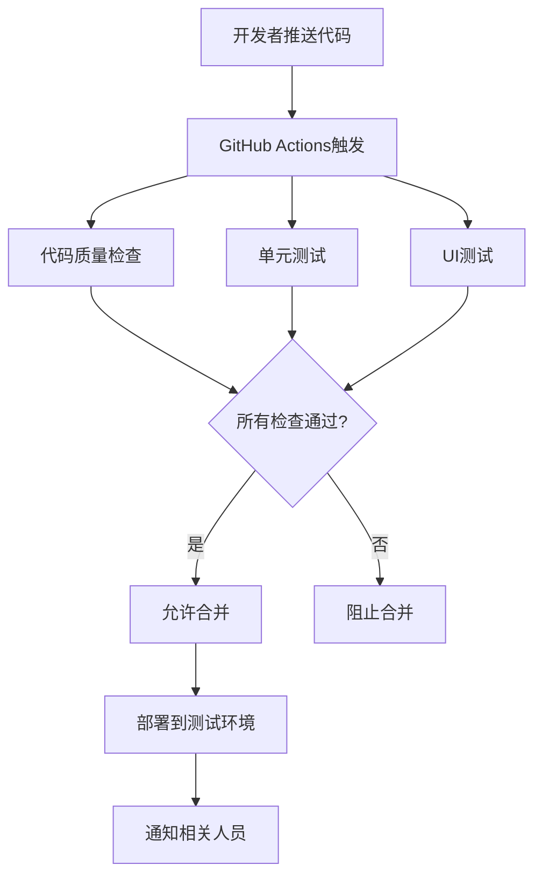

# CI/CD 配置指南

## 📋 概述

这个文档详细说明了 ZHKLine 项目的持续集成和持续部署(CI/CD)配置。

## 🏗️ CI/CD 架构



## 🔧 已配置的工具

### 1. GitHub Actions

- **位置**: `.github/workflows/ci.yml`
- **触发条件**:
  - Push 到 protected 分支 (develop, master/main)
  - 创建 Pull Request 到 protected 分支
- **包含任务**:
  - 代码编译
  - 单元测试执行
  - UI 测试执行
  - 代码覆盖率检查
  - SwiftLint 代码质量检查

### 2. SwiftLint

- **配置文件**: `.swiftlint.yml`
- **检查项目**:
  - 代码风格一致性
  - 最佳实践遵循
  - 潜在问题发现
- **自定义规则**: 已针对项目优化

### 3. Git Hooks

- **预提交钩子**: `scripts/pre-commit`
  - SwiftLint 检查
  - TODO/FIXME 检测
  - 大文件检测
  - Debug 语句检查
- **提交消息钩子**: 强制规范的提交消息格式
- **预推送钩子**: 防止直接推送到 protected 分支

## 🚀 快速开始

### 1. 安装 Git Hooks

```bash
# 在项目根目录执行
./scripts/install-hooks.sh
```

### 2. 配置 GitHub 仓库

按照 `.github/BRANCH_PROTECTION.md` 中的指南配置分支保护规则。

### 3. 验证配置

```bash
# 测试SwiftLint
swiftlint

# 测试编译
xcodebuild -project ZHKLine.xcodeproj -scheme ZHKLine build
```

## 📝 工作流程

### 开发流程

1. **创建分支**

   ```bash
   git checkout develop
   git pull origin develop
   git checkout -b feature/your-feature-name
   ```

2. **开发和提交**

   ```bash
   # 开发代码...
   git add .
   git commit -m "feat(component): 添加新功能描述"
   ```

3. **推送和创建 PR**

   ```bash
   git push origin feature/your-feature-name
   # 在GitHub创建Pull Request
   ```

4. **代码审查**

   - CI 检查必须通过
   - 至少一个审查者批准
   - 所有对话必须解决

5. **合并**
   - 使用"Squash and merge"
   - 删除 feature 分支

### 发布流程

1. **创建发布分支**

   ```bash
   git checkout develop
   git pull origin develop
   git checkout -b release/v1.0.0
   ```

2. **发布准备**

   - 更新版本号
   - 更新 CHANGELOG
   - 最终测试

3. **合并到 master**

   ```bash
   # 创建PR: release/v1.0.0 → master
   # 审查和合并
   ```

4. **创建标签**

   ```bash
   git checkout master
   git pull origin master
   git tag -a v1.0.0 -m "Release version 1.0.0"
   git push origin v1.0.0
   ```

5. **合并回 develop**
   ```bash
   # 创建PR: master → develop
   ```

## 📊 监控和报告

### CI/CD 状态

- GitHub Actions 页面查看构建状态
- Pull Request 页面查看检查结果
- Badges 可添加到 README 显示状态

### 代码质量指标

- SwiftLint 报告
- 测试覆盖率报告
- 构建时间趋势

### 通知设置

- GitHub 通知设置
- Slack 集成 (可选)
- 邮件通知 (可选)

## 🛠️ 故障排除

### 常见问题

1. **SwiftLint 失败**

   ```bash
   # 查看详细错误
   swiftlint lint --reporter json

   # 自动修复可修复的问题
   swiftlint --fix
   ```

2. **测试失败**

   ```bash
   # 本地运行测试
   xcodebuild test -project ZHKLine.xcodeproj -scheme ZHKLine -destination 'platform=iOS Simulator,name=iPhone 15'
   ```

3. **分支保护规则问题**
   - 检查 GitHub 仓库设置
   - 确认状态检查名称匹配
   - 联系管理员检查权限

### 调试步骤

1. 检查 GitHub Actions 日志
2. 本地复现 CI 环境
3. 检查分支保护规则
4. 验证权限设置

## 🔐 安全考虑

### Secrets 管理

- GitHub Secrets 存储敏感信息
- 不在代码中硬编码密钥
- 使用环境变量

### 权限控制

- 最小权限原则
- 代码审查必需
- 分支保护启用

## 📈 性能优化

### 构建优化

- 使用缓存减少构建时间
- 并行执行测试
- 增量构建

### 测试优化

- 仅运行相关测试
- 使用模拟器池
- 智能测试选择

## 📞 支持和联系

- **主要维护者**: @huang
- **问题报告**: GitHub Issues
- **文档更新**: 通过 PR 提交

## 📚 相关文档

- [分支保护配置](.github/BRANCH_PROTECTION.md)
- [贡献指南](../CONTRIBUTING.md)
- [代码规范](../CODE_STYLE.md)
- [项目架构](../PROJECT_ARCHITECTURE.md)
